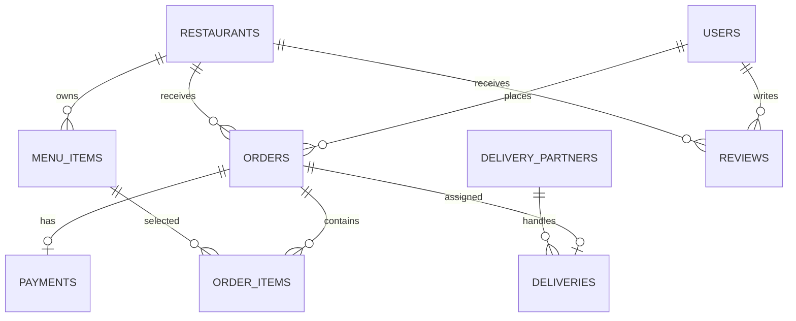

# ER Diagram

```mermaid
erDiagram
  USERS ||--o{ ORDERS : places
  RESTAURANTS ||--o{ MENU_ITEMS : owns
  RESTAURANTS ||--o{ ORDERS : receives
  ORDERS ||--o{ ORDER_ITEMS : contains
  MENU_ITEMS ||--o{ ORDER_ITEMS : selected
  ORDERS ||--o| PAYMENTS : has
  ORDERS ||--o| DELIVERIES : assigned
  DELIVERY_PARTNERS ||--o{ DELIVERIES : handles
  USERS ||--o{ REVIEWS : writes
  RESTAURANTS ||--o{ REVIEWS : receives
```
